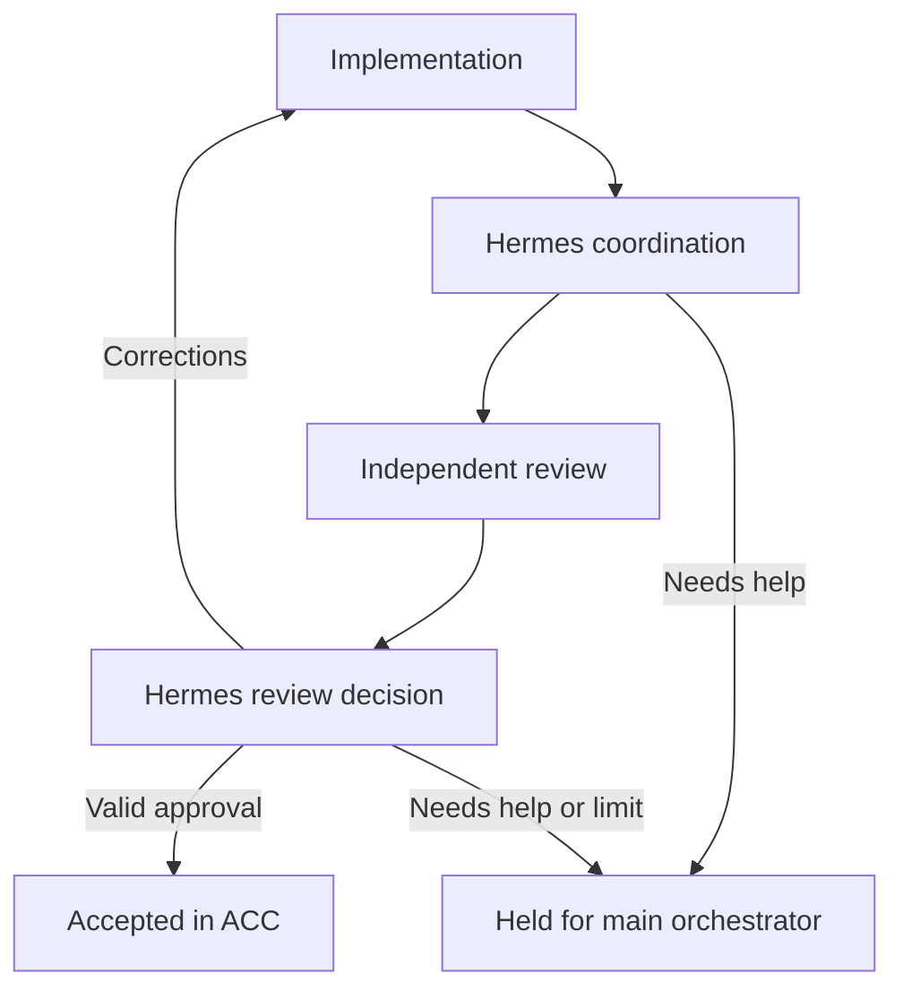

# Hermes background coordination — ACC 0.2

ACC now runs a persistent, sequential implementation/review workflow. Hermes is the model host; ACC owns task state, process supervision, snapshot verification, and permitted transitions. Closing the dashboard does not stop the service. Closing the ACC process does stop supervised work; install a background service if you want it to survive closing the terminal.

## How the handoff works

1. You or the main orchestrator creates a task with the original requirements.
2. Enable its workflow with an implementer, independent reviewer, and coordinator. Enabling authorizes it to begin; creation alone does not.
3. The implementer works in the local project and reports actual checks.
4. ACC waits for the process to finish, captures Git-visible files, and starts Hermes in the coordinator role with the report and requirements.
5. Hermes proposes `request_review` or `hold`. ACC validates that proposal and launches the chosen reviewer in the snapshot directory.
6. The reviewer returns `approve` or `changes_requested`, findings, and checks. A zero process exit alone is insufficient.
7. Hermes interprets that review and proposes `accept`, `request_changes`, or `hold`. ACC accepts only an approving review bound to the current implementation, requirements, and unchanged snapshot/project.
8. Corrections return to implementation with the previous findings in the packet, then repeat coordination and review. The configured round limit stops endless retries. Publishing and merging are separate; this workflow does neither automatically.



ACC starts a fresh Hermes one-shot process for each role turn. You do not need a Hermes messaging gateway or scheduled model polling for this workflow. The database dispatcher wakes between stages and invokes the model only when there is actual work. An optional interactive Hermes session can control ACC through MCP.

## Host setup

Install Hermes using its [official installation instructions](https://github.com/NousResearch/hermes-agent). The connector targets the documented `chat --query-file --oneshot --format stream-json` interface and requires a Hermes release supporting those flags. Check `hermes chat --help` on your host.

Create separate Hermes profiles so implementation, review, and coordination do not share a conversation or accidentally inherit each other's provider settings:

```sh
hermes profile create acc-deepseek --no-alias
hermes profile create acc-claude --no-alias
hermes profile create acc-coordinator --no-alias
hermes profile create acc-local-builder --no-alias
hermes profile create acc-local-reviewer --no-alias
```

Configure each desired profile with `hermes -p PROFILE model`. Use DeepSeek for `acc-deepseek`, Anthropic for `acc-claude`, and a self-hosted model endpoint for the local profiles. You only need profiles for the roles you intend to use. Credentials remain in Hermes' configuration. ACC does not request, copy, or publish provider keys.

For local Ollama, Hermes documents the Custom Endpoint setup at `http://localhost:11434/v1`. Configure a downloaded model that supports tool use and sufficient context. A `local: true` adapter declaration is your configuration claim, not proof that every plugin or auxiliary model is offline; check the profile's provider, auxiliary models, and tools. Run an actual disconnected task before relying on it. Hardware performance and model quality have not been benchmarked by this connector test.

Copy [examples/hermes-agents.json](../examples/hermes-agents.json) to a private configuration location. Its profiles are examples, not installed or authenticated accounts. Every `driver: "hermes"` entry uses the real Hermes CLI with its own profile; DeepSeek and Claude in this example are model providers inside Hermes, not standalone vendor CLI processes. Existing custom `argv` adapters remain supported.

Hermes adapter fields:

| Field | Meaning |
| --- | --- |
| `id`, `name` | Stable ACC assignment ID and visible label. |
| `driver` | `hermes` selects the included CLI adapter. |
| `executable` | Optional absolute path to Hermes; defaults to `hermes` on PATH. Use an absolute path in background services. |
| `profile` | Optional isolated Hermes profile. |
| `provider`, `model` | Optional per-run overrides; otherwise the profile determines them. |
| `local` | Explicit declaration that this adapter is configured for local operation; required for offline fallback selection. |

Start ACC from its repository:

```sh
python3 -m acc --project /path/to/project --agents /private/hermes-agents.json --state-dir /private/acc-state
```

Windows PowerShell:

```powershell
py -3 -m acc --project "C:\Projects\HearthandHavoc" --agents "C:\ACC-Config\hermes-agents.json" --state-dir "C:\ACC-State"
```

Use a state directory **outside** the managed project. Open the printed local link, create a task, and expand **Background coordination**. Select the three roles, correction limit, and any permitted local fallbacks, then choose **Enable workflow**. The UI shows the active worker, stage, next step, round, snapshot ID, reports, and run history. Finding the executable means configured, not authenticated or model-ready.

The adapter uses a UTF-8 prompt file, not shell interpolation. It forwards Hermes JSONL activity to ACC as it arrives, requires a successful terminal `result` event, and parses the final response as JSON. It never adds `--yolo` or bypasses Hermes approval settings. Configure narrowly scoped unattended tool permissions in Hermes itself; if it cannot perform a required command, ACC retains the failure instead of claiming success.

## Optional Hermes MCP connection

For an interactive orchestrator profile, generate a configuration fragment:

```sh
python3 -m acc.hermes config --url http://127.0.0.1:8765 --token-file /private/acc-state/token --output /private/acc-mcp.json
```

The output is JSON (also valid YAML) with `mcp_servers.acc.command` and `args`. Merge that entry into the interactive profile's Hermes `config.yaml`; do not replace existing settings. The generated paths are absolute, so Hermes may start the bridge from any directory. The fragment refers to the token file without containing the token.

Do not add ACC control tools to the dedicated background worker profiles. Those workers return proposals through their result contract; the ACC service applies them. The interactive orchestrator uses `acc_create_task`, `acc_state`, `acc_report`, and `acc_configure_workflow` to manage the plan. Existing manual task tools remain available.

Example `acc_configure_workflow` arguments:

```json
{
  "task_id": "TASK_ID_FROM_ACC",
  "implementer": "deepseek",
  "reviewer": "claude",
  "coordinator": "hermes-coordinator",
  "enabled": true,
  "max_rounds": 3,
  "mode": "online",
  "fallbacks": {"implementer": "local-builder", "reviewer": "local-reviewer"}
}
```

## Switching, failures, offline work, and restart

- **Pause workflow** prevents further launches; the current process may finish. **Stop now** terminates the supervised process tree and holds the workflow for inspection.
- Change assignments while idle or paused, then **Save and resume workflow**. Active ownership transfer is blocked. Changing the reviewer invalidates an existing review. Changing requirements disables the old workflow; enable a fresh one.
- **Offline mode** uses only the declared local adapter or an explicitly permitted local fallback. Missing local coverage holds the task and explains what is missing. Preferred cloud assignments are preserved.
- Select **Online** between runs to return to preferred agents. This release does not continuously probe internet availability or automatically interrupt/resume cloud workers when connectivity changes.
- A failed coordinator process can automatically try its explicitly configured local coordinator fallback once for that decision. Failure is not labelled an internet outage: it could also be authentication, quota, or another runtime error. Failed implementers/reviewers hold for inspection because they may have partial work. A timeout also holds.
- Missing/invalid JSON, stale run IDs, changed snapshots, and premature acceptance hold the workflow visibly. No silent advancement or infinite retries.
- Use **Restart implementation** after inspecting changed files or when you need a fresh snapshot. It retains the files and run history but starts a fresh review cycle; it does not undo changes.
- Queued enabled stages survive service restart. A crash during launch, execution, or result processing requires the existing process-tree recovery step, followed by an explicit resume. A launch with no recorded PID still requires inspection; absence of a PID is not evidence that no process started.

## Keep it running in the background

Linux: customize [examples/acc.service](../examples/acc.service), place it at `~/.config/systemd/user/acc.service`, then run `systemctl --user daemon-reload` and `systemctl --user enable --now acc.service`. Use absolute Python, project, config, and Hermes executable paths. The service has no model dependency of its own; local inference must also be running. User services normally follow the login session unless lingering is enabled through your normal system administration setup.

Windows: use Task Scheduler with an **At log on** trigger. Set Program to the absolute Python executable, Arguments to `-m acc --project "..." --agents "..." --state-dir "..."`, and **Start in** to the ACC repository. Select **Do not start a new instance**. Use the same Windows user that owns the Hermes profiles. This Windows deployment and native process-tree termination still need validation on the actual host; Linux process supervision is the tested path.

The machine must stay awake. The browser can close. No tunnel is needed for local connections. Remote access from this ChatGPT conversation remains a separate connection to provision.

## Snapshot scope and execution boundary

Snapshots contain tracked files (including modifications) and nonignored untracked files under the managed project, preserving executable bits. Deleted files remain absent. Git-ignored dependencies, credentials, and build outputs are excluded; reviewers may need a separate scratch environment to run checks. Limits: 10,000 paths and 100 MiB. Symlinks and submodules are rejected rather than silently following external content. Larger asset-heavy Unity repositories need a scoped review strategy before using whole-project workflows.

The saved copy is hash-verified before review, after review, and before acceptance, along with the current project. It is **not an OS sandbox** or a read-only filesystem. Workers have the host user's access. Hash checks detect persistent changes to included files; they cannot prevent an agent from making other changes, transient edits, or network calls. Independent adapters are separate sessions, not proof of different model vendors or correctness. Checks in reports are attributed claims, with process output available for inspection.

## Verification and limits

Run `python3 -m unittest discover -s tests -v` and `node --check acc/web/app.js`. The suite runs real local subprocesses, HTTP calls, snapshot checks, and the Hermes CLI adapter, using **scripted model responses**. It covers corrections, budgets, false approvals, stale results, mutated snapshots, local fallback, switching, pause/restart, and launch recovery.

An optional `mcp` Python SDK test uses a real SDK client through stdio → HTTP → ACC and completes the background workflow. Install `mcp` in a separate test virtual environment and run `python -m unittest discover -s tests -p test_mcp_sdk.py -v`. It is not an ACC runtime dependency.

Hermes itself and live DeepSeek/Claude/local inference were not available in the implementation environment. The tests establish transport/adapter/state-machine behavior, not model quality, model login, or native Windows/browser behavior. First host validation should be a small disposable Git project with one implementation and one independent review.

Interface sources checked September 16, 2026:

- [Hermes CLI commands and stream event contract](https://hermes-agent.nousresearch.com/docs/reference/cli-commands)
- [Hermes MCP configuration](https://hermes-agent.nousresearch.com/docs/user-guide/features/mcp)
- [Hermes local and cloud providers](https://hermes-agent.nousresearch.com/docs/integrations/providers)
