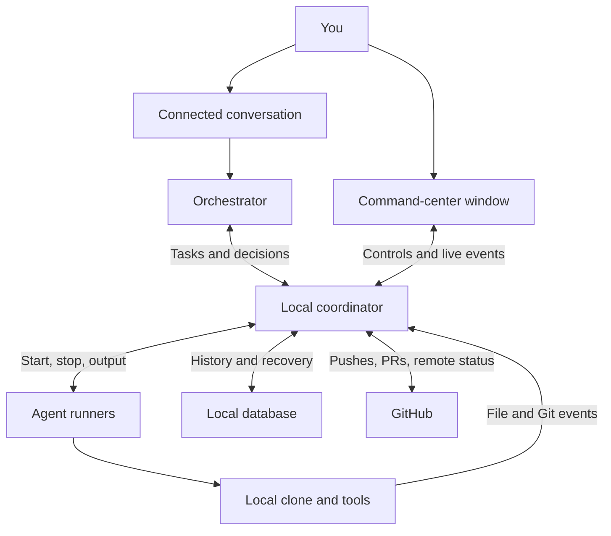
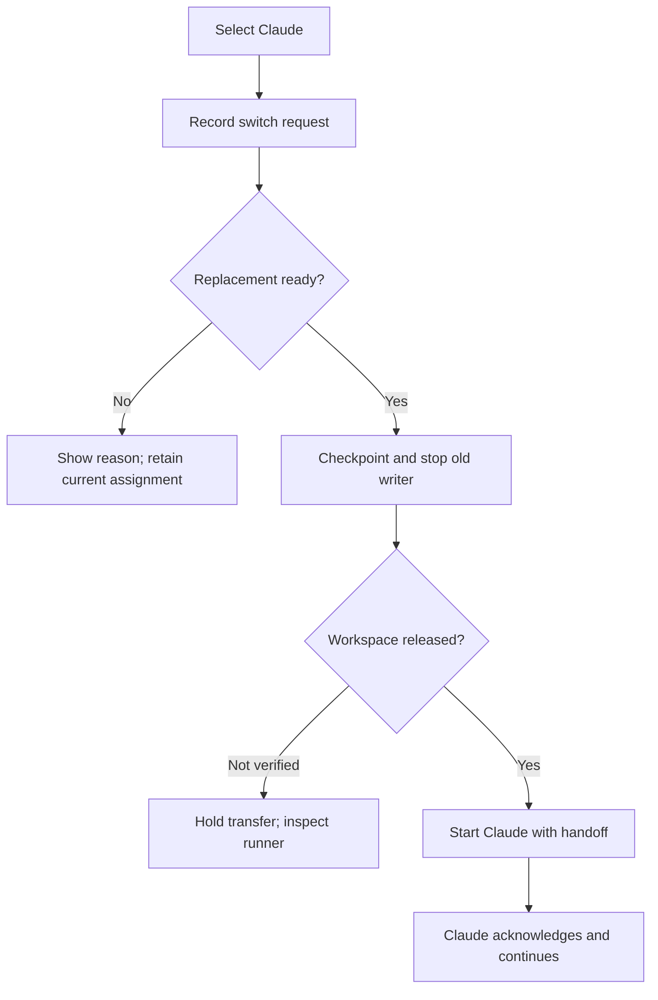

# Project Command Center — Complete Workflow and Implementation Plan

Revision 2 · September 16, 2026 · Working name: Project Command Center

This revision replaces the earlier plan. It makes direct local activity streams the primary source of progress, distinguishes local Git from GitHub, and describes the complete user experience. All screens and examples are proposed behavior, not evidence that the product or provider connections already exist.

## 1. The product in one paragraph

You talk to your connected orchestrator, such as ChatGPT through your remote workflow. It records your request, divides the work, and assigns agents. A command-center window on your Windows or Linux computer shows those instructions, assignments, actual operations, changes, reviews, and next steps. Selecting another agent in that window starts the transfer without another chat message. Workers operate on local project files; compatible local models can continue prepared work offline. GitHub adds publishing and collaboration history when connected.

**The command center is the visible control surface and execution record. The orchestrator plans the work; the local coordinator reliably applies those plans and your controls.** The coordinator is ordinary software, so switching an already configured worker does not require an extra model response.

## 2. Where everything runs

| Location | What lives there |
| --- | --- |
| Your phone or remote conversation | You give instructions, discuss designs, and receive the orchestrator's response. |
| Your Windows/Linux computer | Command-center service, dashboard, local clone, task database, worker runners, local model runtime, and installed development tools. |
| Online model providers | Cloud inference for configured workers. A cloud model can direct a local runner that edits files on your computer. |
| GitHub | Pushed commits, pull requests, remote reviews, Actions/check results, and merge records. |

The dashboard can initially open in a local browser window. Its bundled interface and local service work without internet. A desktop launcher/package can be added without changing the workflow.

Local operation requires no public receiver, tunnel, or relay. Remote ChatGPT access still uses its own established connection. Direct phone access to the dashboard is a separate later feature, not a prerequisite for watching the local project window.

## 3. Complete connection map

The orchestrator bridge must be deliberately connected. The app does not silently read unrelated chat sessions. Verify the chosen remote host can call the bridge during the first build milestone. Externally hosted workers require their own supported adapter; arbitrary existing sessions cannot be assumed controllable.

## 4. Walkthrough: from your request to a reviewed PR

Use this illustrative request: “Implement exact-level specialist staffing. Every requirement must be met. Preserve interrupted progress.”

| Step | What happens | What you see |
| --- | --- | --- |
| 1. You speak | The connected orchestrator records your instruction and relevant project context. | The original request appears under Instructions. |
| 2. Work is divided | It creates tasks, dependencies, acceptance checks, and assignments. | A task list with implementer, reviewer, and next step. |
| 3. Work starts | The coordinator checks the assignment and starts the configured runner. | “DeepSeek — reading staffing rules.” |
| 4. Implementation proceeds | The runner emits tool events; file watchers report saved changes. | Current operation, changed files, and expandable output. |
| 5. You adjust the plan | You edit priority, change the assigned agent, or provide new requirements. | A persisted command and its actual acknowledgement/progress. |
| 6. Checks run | Local commands produce test or build evidence tied to the current revision. | “18 passed, 2 failed,” with the actual results available. |
| 7. Review happens | The reviewer inspects a fixed snapshot against the requirements. | Findings, requested corrections, or approval. |
| 8. Corrections finish | The implementer addresses findings; affected checks and review are repeated. | Clear remaining work and updated evidence. |
| 9. Changes are published | The authorized coordinator commits, pushes, and opens a PR under project policy. | Commit IDs, publication state, and the confirmed PR link. |
| 10. Work closes | The task reaches its defined acceptance state; merge remains separately visible. | Implementation, verification, review, PR, and merge status. |

The example is illustrative, including the test counts. No fabricated activity should appear in the operational product.

## 5. What the window looks like

Favor a dense, readable workspace with minimal empty space. Keep plain language visible and technical details expandable.

| Screen area | Contents and behavior |
| --- | --- |
| Top bar | Project, local folder/branch, orchestrator, local connection, and GitHub synchronization state. |
| Request strip | Latest instruction, current requirement revision, and acknowledgement status for affected workers. |
| Main task list | Task, preferred/assigned agent selector, actual worker, current operation, status, and next step. |
| Selected-task panel | Instructions, requirements, dependencies, evidence, changed files, reviews, and handoff history. |
| Live activity feed | Timestamped tool starts/results, file changes, errors, local commits, and remote confirmations. |
| Progress line | Counts of verified, working, blocked, and queued tasks; no invented percentage. |
| Controls | Switch safely, pause/resume, stop now, request second opinion, adjust priority, and open evidence. |

Suggested task detail tabs: Overview, Instructions, Changes, Checks and Review, and History. Project-level views can include Tasks, Agents, Git History, and Settings. Build only working controls; unavailable integrations must be labeled rather than represented by decorative buttons.

The adjacent interface preview demonstrates task selection, assignment changes, and offline fallback with simulated data. It is a design aid, not a connected application.

## 6. Live activity: events first, check-ins second

**Do not wait for a milestone, checkpoint, or periodic model-written summary to update the screen.**

| Source | Connection behavior | What it can prove |
| --- | --- | --- |
| Agent runner | Forward supported tool events and streamed output as received. | A command started, a tool returned, an operation failed, or a run ended. |
| File watcher | Observe saves; debounce bursts and reconcile diffs. | A local file changed, including edits made outside managed agents. |
| Local Git observer | Inspect Git state after relevant changes and coordinator-owned Git operations. | A local commit or branch change exists; files differ from a known revision. |
| Orchestrator bridge | Record plans, explanations, requirements, and task decisions. | What the orchestrator assigned or reported. |
| GitHub adapter | Show responses to actions it initiates; refresh externally changed state. | A push/PR was confirmed, or a remote review/check state was retrieved. |
| Health monitor | Periodic process/connection checks, initially around 20 seconds. | Runner availability, not correctness or guaranteed progress. |

Target local UI updates within roughly one second after the coordinator receives an event. This is an implementation target to measure, not a provider latency guarantee. Providers and tools may buffer output. If only “model request in progress” is available, display that rather than inventing a more specific activity.

Do not ask the model to narrate every second. Build plain-language activity from actual tool events, with model summaries used for intent and explanations. Raw output remains available when appropriate; private credentials must not be copied into dashboard events.

Store event IDs, task/run IDs, source timestamps, received timestamps, and sequence numbers. Replaying events after reconnection must not duplicate actions or timeline entries. Treat file watcher notifications as change signals and read the actual Git/file state before claiming a result.

## 7. Local Git versus GitHub

Most development visibility comes from the local clone. Uncommitted edits, local diffs, tests, and local commits need no GitHub connection.

When the coordinator pushes or creates a PR, display “Sending” immediately and “Confirmed” only after the remote result. A local commit and a pushed commit have distinct states. A timed-out publication request may have succeeded remotely; check before retrying.

Remote reviews, GitHub Actions, merges, or changes made elsewhere require GitHub synchronization. Initially use refresh after our own actions plus periodic API reconciliation, with the last successful refresh visible. GitHub webhooks are an optional later way to receive external changes sooner; they require a reachable receiver and are not needed for live local activity.

For HearthandHavoc, retain `temporary` as the reusable source for PRs into `main`. Preserve it after merge. Make branch policy configurable for other projects and establish the new command-center repository's policy when it is created.

Track which run produced a change explicitly; do not infer the model from Git authorship. Attribute outside edits as external or unknown until linked. Do not indiscriminately commit every dirty file in a user's clone.

## 8. Switching agents during work

A selection change submits an actual command immediately. Show preferred agent, active worker, and transfer state separately.

Default to **Switch safely**: finish a bounded operation or checkpoint, stop the old writer and its relevant children, preserve changes, and start the replacement. A separate **Stop now** control interrupts work; mark any partial edits and unfinished checks for inspection.

A handoff contains original/current requirements, requirement revision, starting commit, current file snapshot/diff including relevant untracked files, evidence, known failures, remaining work, and outstanding external operations. Summaries supplement actual files; they do not replace them. The new model cannot inherit the previous model's internal reasoning state.

Only one writer owns a shared workspace. A database ownership record alone does not stop an old process: the adapter must establish that it has stopped or cannot write before reassignment. If that cannot be proven, block same-workspace transfer or continue in an isolated snapshot with later integration.

Run IDs and command IDs make repeated clicks safe. Switching a queued task simply changes its future assignment. Changing the default agent affects future tasks unless the user separately transfers active work.

If the replacement fails to start, keep the checkpoint and show “Transfer blocked.” Do not label it working. Previously sent external operations are reconciled before retrying.

## 9. When you change instructions

Preserve the original request and add a new requirement revision. Identify affected tasks, notify their runners, and display pending versus acknowledged updates. A worker may finish a noninterruptible operation before applying the new instruction; the window must show that delay.

For example, “Do not change the save format” becomes a current constraint on implementation and review. The orchestrator determines whether completed work needs correction. User-selected assignments should not be silently reversed by the orchestrator.

If the orchestrator connection goes away, the local coordinator can keep executing already authorized tasks and configured controls. Novel planning that requires the orchestrator shows “Waiting for orchestrator” unless an explicitly configured local planning fallback is available.

## 10. Offline continuation and return online

Per task, configure preferred online agent, compatible local fallback, and policy: automatic fallback, ask, or pause. An offline example should read “Preferred: Claude · Active: local model · Working offline.”

Models, runtime, source files, tools, dependencies, and task context must already exist locally. Capability checks determine which tasks the model can perform; being installed does not imply sufficient coding or tool capability. Allow CPU/RAM and concurrency limits.

On connectivity loss, determine whether the online request/runner has actually stopped. Network loss alone is not proof that a writer has stopped. Use the same handoff and ownership rules as manual switching. Continue eligible local code/tests/tool jobs and queue remote-only actions.

When the preferred provider is reachable again, stabilize the connection, let local work reach a safe boundary, preserve its results, and return control. Avoid switching back and forth with intermittent connectivity. The returning agent inspects offline changes and outstanding actions before continuing.

Queued online work preserves intent, but is checked against current state before execution. Restarting or reconnecting must not cause duplicate commits, PRs, or provider runs.

## 11. Reviews, failures, and second opinions

Separate run completion from task acceptance. Tests passing, review approval, visual verification, PR creation, and merge are distinct outcomes with supporting evidence.

A reviewer inspects a fixed commit or snapshot and records findings against it. If files change, the interface identifies that the review is stale where relevant. Do not review a moving workspace as though it were a stable artifact.

The user can request a second opinion without replacing the implementer. As an initial configurable policy, repeated unsuccessful repairs trigger escalation after two attempts. Send the reviewer the requirement, changes, actual failure output, and previous attempts.

Cancellation, provider failure, permission failure, test failure, and lost connection have different statuses. Show the reason and next available action instead of reducing all of them to “agent offline.”

## 12. Implementation responsibilities

| Module | Initial implementation |
| --- | --- |
| Dashboard | Bundled TypeScript interface, local controls, task details, live feed, and clear stale/offline states. |
| Coordinator | Python service with task/assignment state, command processing, event ingestion, and workspace ownership. |
| Persistence | SQLite for project records, instructions, task revisions, runs, commands, events, handoffs, and evidence references. |
| UI transport | Local HTTP for commands and server-sent events for updates/replay. No public receiver for local operation. |
| Orchestrator bridge | MCP tool interface to create/update tasks, register decisions/evidence, and receive or fetch persisted user commands. |
| Worker adapters | Capability discovery, start, activity output, status, checkpoint where supported, cancellation, and result collection. |
| Workspace observer | Local file/Git change detection, debounce, and state reconciliation. |
| GitHub adapter | Outbound authenticated API/Git operations, remote-state refresh, and duplicate-action reconciliation. |
| Process supervisor | Platform-specific child process control and restart recovery for Windows and Linux. |

Keep the adapter interface explicit: available capabilities, provider/model identity, authentication route, billing route, and supported cancellation behavior. MCP is a tool connection, not an automatic process supervisor or guarantee that any chat can receive an interrupt.

Choose compatible framework versions at implementation time. Keep dependencies small. Store credentials through local credential references, not in task packets or committed files. Bind the service locally and protect control endpoints with a local session token and origin checks. Record user/control events so the orchestrator and interface share one authoritative state.

## 13. Providers and existing projects

Start with the existing orchestrator connection, one real coding worker, then a second worker to prove reassignment. Treat Claude, DeepSeek, Grok, and local models as adapter targets, not already installed connections. Verify each host's streaming events, tool use, cancellation, and billing before marking it supported.

DeepAstra was considered as an optional starting point for a bespoke DeepSeek launcher; ACC instead built the generic `acc/hermes.py` CLI adapter, routing DeepSeek through Hermes as one of its configured model providers rather than a standalone launcher. That adapter has since been audited against the same five concerns DeepAstra raised: process cleanup, prompt-delivery timeout, failure exit code, and instruction loading are solid (process-group inheritance reaches Hermes and its children; the prompt goes through `--query-file` rather than piped stdin, avoiding a pipe-deadlock class of bug; OS exit code and Hermes's own internal result event are both checked; the full task packet, including its instruction text, is what gets written to the query file) — a real, narrower gap was found and fixed (a mid-stream stdout failure could leave Hermes running unsupervised until ACC's own outer timeout eventually reached it; it now kills the process immediately). Windows process-tree termination remains genuinely unverified, same as always: there is no Windows host to test it on.

The command center remains a separate development tool, not a game runtime dependency. For HearthandHavoc, the pipeline continues to own Blender/Unity jobs; a single pipeline coordinator forwards job activity and evidence. The command center does not start competing controllers against the same pipeline state. Framerate work is tracked as project tasks and dependencies, with actual native verification separate from simulated checks.

Other repositories can later use the same task/event contracts. Provider-specific code must stay out of the core task model.

## 14. Delivery order and visible acceptance

| Stage | Build | Prove it by showing |
| --- | --- | --- |
| A. Local live loop | Database, basic dashboard, orchestrator bridge, one worker, event stream, and local observer. | A real instruction becomes a task; tool and file events appear without waiting for a heartbeat; restart retains history. |
| B. Direct control | Second worker, pause/cancel, safe switching, handoff record, and requirement updates. | Select another agent; old writer stops; new worker resumes the preserved task; repeated clicks do not duplicate runs. |
| C. Review and Git history | Fixed-snapshot review, local commit attribution, authorized publication, PR links, and remote synchronization. | Follow one task from request through actual diff, checks, review, local commit, push, and PR. |
| D. Offline continuity | Local model adapter, prepared offline tasks, return-online policy, and resource limits. | Disconnect during a controlled task; continue locally; reconnect and review/transfer without losing or duplicating work. |
| E. Expansion | Native pipeline evidence, more providers/projects, Windows/Linux packaging, optional remote dashboard access. | Each new connector is demonstrated independently with truthful capability/status labels. |

Start with a usable slice, not a dashboard full of unsupported integrations. Use mock workers for development but label them clearly. Estimate later stages from observed adapter behavior instead of requiring the full future scope before the first useful window.

## 15. Checks that matter

- Local events render promptly after receipt; reconnection replays without duplicates.
- A quiet model request stays “waiting for response,” not a fabricated detailed activity.
- File changes outside the command center appear without false agent attribution.
- Shared-workspace writers never overlap during a transfer.
- Cancellation stops relevant child processes on each supported operating system.
- Missing heartbeats do not automatically create duplicate workers.
- Restart reconciles in-flight work and preserves commands/history.
- Revised instructions are versioned; worker acknowledgement is visible.
- Review and check results identify the exact code snapshot examined.
- A failed/timed-out push or PR request is reconciled before retrying.
- Offline fallback and return use real workers before being labeled supported.
- Bundled local UI and eligible jobs function with internet disabled.

## 16. Repository and next action

Suggested repository: `Project-Command-Center`. Suggested folders: `apps/dashboard/`, `service/`, `adapters/`, `contracts/`, `tests/`, and `docs/`. Store this plan as `docs/PROJECT-PLAN.md` with startup instructions in the README. Runtime databases, credentials, raw private logs, and managed project clones stay outside source control.

Initial assumptions: single user; one local computer coordinating work; Windows/Linux target; local browser interface first; one writer per shared workspace. Parallel implementation can be added through isolated workspaces with explicit integration, without forcing a permanent branch for every agent.

After the repository is created, establish its branch policy and implement Stage A. The first demonstration is your real instruction becoming visible local work. The next is changing that work's agent from the screen without sending another chat message.
